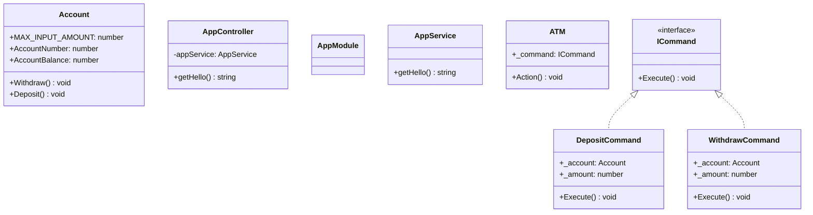

```mermaid
classDiagram


class Account{
            +MAX_INPUT_AMOUNT: number
+AccountNumber: number
+AccountBalance: number
            +Withdraw() void
+Deposit() void
        }
class AppController{
            -appService: AppService
            +getHello() string
        }
class AppModule{
            
            
        }
class AppService{
            
            +getHello() string
        }
class ATM{
            +_command: ICommand
            +Action() void
        }
class DepositCommand{
            +_account: Account
+_amount: number
            +Execute() void
        }
ICommand<|..DepositCommand
class ICommand {
            <<interface>>
            
            +Execute() void
        }
class WithdrawCommand{
            +_account: Account
+_amount: number
            +Execute() void
        }
ICommand<|..WithdrawCommand
```